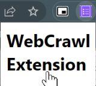

# Schlumberger_NewYearHackathon_2023
Crawl any news feed URL to summarize the content using NLP tools.

## Instructions to Run Repository
This repo has 3 parts:
- An extension for Chrome Webrowser
- A Flask Backend Server
- A Google Colab Notebook to show of how Summarization should work

## Instructions to Run Backend
- **Important: Requires Python 3.11 installed in a Linux system**
1. Clone this repo and `cd` into the cloned folder
1. Run `bash local_setup.sh` to setup venv and python libraries
1. Run `bash local_run.sh` to start Flask server
1. Open `localhost:5000` to access the client website
1. *Ctrl*+*C* to Stop both servers

## Instructions for Loading Backend
- For loading the extension see the instructions at [Loading an unpacked extension](https://developer.chrome.com/docs/extensions/mv3/getstarted/development-basics/#load-unpacked). Note: the directory to point to is `webcrawl-extension`.
- After loading, the extension works if you see this on clicking it:

- Follow instructions in `localhost:5000` page and then reload.

## Colab Notebook
Link to Notebook: [schlumbergers-new-year-hackathon-summarizer.ipynb](https://colab.research.google.com/drive/1SKCMSgSH1ed5QqSthn7PO0IZi9L3XFOC?usp=sharing).

The notebook is also locally available in the `notebooks` folder. Note: It is assumed that the notebook is running after `transformers` library has been installed locally by `local_setup.sh`.